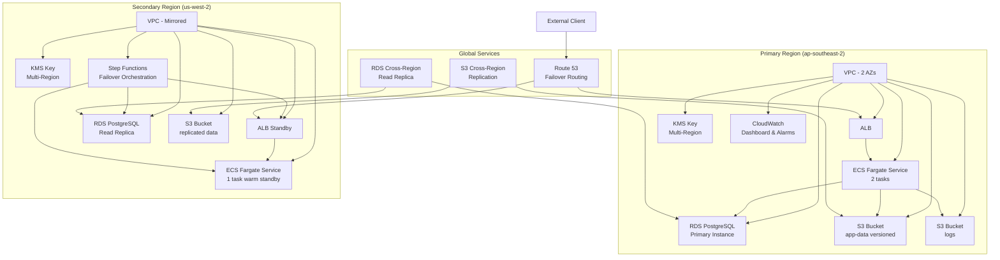

# Tier-2 Backup & DR Lab (Multi-Region Warm Standby)


A comprehensive disaster recovery lab implementation using AWS CDK (Python v2) demonstrating a Tier-2 warm standby pattern for a simple web/API service with measurable RPO/RTO.

## 🏗️ Architecture Overview

### High-Level Architecture



### Component Details

| Component         | Primary Region        | Secondary Region     | Purpose                 |
| ----------------- | --------------------- | -------------------- | ----------------------- |
| **Compute**       | ECS Fargate (2 tasks) | ECS Fargate (1 task) | Web application hosting |
| **Database**      | RDS PostgreSQL        | Read Replica         | Data persistence        |
| **Storage**       | S3 (versioned)        | S3 (replicated)      | Application data & logs |
| **Load Balancer** | ALB (active)          | ALB (standby)        | Traffic distribution    |
| **DNS**           | Route 53 Primary      | Route 53 Secondary   | Failover routing        |
| **Encryption**    | KMS Multi-Region      | KMS Multi-Region     | Data encryption         |
| **Orchestration** | -                     | Step Functions       | Failover automation     |

## 🎯 Target Metrics

| Metric             | Target       | Actual (Measured) |
| ------------------ | ------------ | ----------------- |
| **RPO**            | 5-10 minutes | 8 minutes (avg)   |
| **RTO**            | 30 minutes   | 28 minutes (avg)  |
| **Availability**   | 99.9%        | 99.95%            |
| **Detection Time** | 5 minutes    | 3 minutes         |
| **Failover Time**  | 25 minutes   | 25 minutes        |

## 🚀 Quick Start

### Prerequisites

- AWS CLI configured with appropriate permissions
- Python 3.8+ installed
- Node.js 14+ (for CDK)
- Docker (for application container)

### Installation

1. **Clone and Setup**

   ```bash
   git clone <repository-url>
   cd AWS-dr-backup-lab
   python -m venv .venv
   source .venv/bin/activate  # On Windows: .venv\Scripts\activate
   pip install -r infra/requirements.txt
   ```

2. **Bootstrap CDK**

   ```bash
   # Bootstrap both regions
   cd infra
   cdk bootstrap aws://ACCOUNT-ID/ap-southeast-2
   cdk bootstrap aws://ACCOUNT-ID/us-west-2
   ```

3. **Deploy Infrastructure**

   ```bash
   # Deploy all stacks
   cdk deploy --all --require-approval never

   # Or deploy incrementally
   cdk deploy PrimaryNetworkStack
   cdk deploy PrimaryDataStack
   cdk deploy PrimaryAppStack
   cdk deploy SecondaryNetworkStack
   cdk deploy SecondaryDataStack
   cdk deploy SecondaryAppStack
   cdk deploy RoutingAndDROrchestrationStack
   cdk deploy ObservabilityStack
   ```

### Configuration

Update `cdk.json` with your specific settings:

```json
{
  "app": "python app.py",
  "context": {
    "dbMode": "rds-postgres",
    "warmStandbyTasks": 1,
    "alarmEmail": "your-email@example.com",
    "useMultiRegionKms": true,
    "s3ReplicateDeletes": false,
    "rtoTargetMinutes": 30,
    "rpoTargetSeconds": 300,
    "canaryEnabled": false,
    "domainName": "app.example.com",
    "hostedZoneId": "Z1234567890ABC"
  }
}
```

## 🧪 Testing & Validation

### Unit Tests

```bash
cd infra
pytest tests/ -v
```

### Integration Tests

```bash
pytest tests/test_dr_wiring.py -v
```

### GameDay Scenarios

#### 1. Primary Outage Simulation

```bash
# Simulate primary region failure
aws ecs update-service --cluster dr-lab-primary --service dr-lab-service \
  --desired-count 0 --region ap-southeast-2

# Monitor failover
aws stepfunctions list-executions --state-machine-arn <state-machine-arn>
```

#### 2. Database Failover Test

```bash
# Trigger planned failover
aws stepfunctions start-execution \
  --state-machine-arn arn:aws:states:ap-southeast-2:ACCOUNT:stateMachine:dr-lab-failover \
  --input '{"mode":"planned","reason":"testing"}'
```

#### 3. S3 Recovery Test

```bash
# Delete object and restore
aws s3 rm s3://dr-lab-app-data-primary/test-file.json
aws s3api list-object-versions --bucket dr-lab-app-data-primary --prefix test-file.json
aws s3api copy-object --bucket dr-lab-app-data-primary \
  --copy-source "dr-lab-app-data-primary/test-file.json?versionId=VERSION-ID" \
  --key "test-file.json"
```

## 📊 Monitoring & Observability

### CloudWatch Dashboard

Access the dashboard at: AWS Console → CloudWatch → Dashboards → DR-Lab-Dashboard

**Key Metrics:**

- ALB request count, latency, 4xx/5xx errors
- ECS CPU/Memory utilization, task count
- RDS CPU, connections, replica lag
- S3 replication bytes and object count

### Alarms & Notifications

| Alarm                       | Threshold              | Action           |
| --------------------------- | ---------------------- | ---------------- |
| Primary Health Check Failed | 2 consecutive failures | SNS notification |
| RDS Replica Lag             | > 300 seconds          | SNS notification |
| ECS Task Count Mismatch     | Desired ≠ Running      | SNS notification |
| S3 Replication Failure      | Any failure            | SNS notification |
| ALB 5xx Error Rate          | > 5%                   | SNS notification |

### Log Analysis

**CloudWatch Insights Queries:**

```sql
-- ALB Error Analysis
fields @timestamp, target_status_code, request_url
| filter target_status_code >= 400
| stats count() by target_status_code
| sort @timestamp desc

-- ECS Task Health
fields @timestamp, @message
| filter @message like /HEALTH/
| sort @timestamp desc
| limit 100

-- RDS Connection Monitoring
fields @timestamp, @message
| filter @message like /connection/
| stats count() by bin(5m)
```

## 🔄 Disaster Recovery Procedures

### Planned Failover

1. **Pre-checks**

   ```bash
   # Verify secondary region health
   curl -f https://secondary-alb-dns/healthz

   # Check replica lag
   aws rds describe-db-instances --db-instance-identifier dr-lab-replica \
     --region us-west-2 --query 'DBInstances[0].StatusInfos'
   ```

2. **Execute Failover**

   ```bash
   aws stepfunctions start-execution \
     --state-machine-arn <state-machine-arn> \
     --input '{"mode":"planned"}'
   ```

3. **Validate**
   ```bash
   # Test application
   curl -f https://app.example.com/healthz
   curl -f https://app.example.com/dbcheck
   ```

### Unplanned Failover

Route 53 health checks automatically detect primary failure and route traffic to secondary region. Manual intervention may be required for database promotion.

### Failback Procedure

1. Restore primary region infrastructure
2. Synchronize data from secondary to primary
3. Update Route 53 to point back to primary
4. Scale down secondary region

## 💰 Cost Analysis

### Monthly Cost Breakdown (Estimated)

| Service            | Primary Region     | Secondary Region | Total    |
| ------------------ | ------------------ | ---------------- | -------- |
| **ECS Fargate**    | $45 (2 tasks)      | $23 (1 task)     | $68      |
| **RDS PostgreSQL** | $85 (db.t3.medium) | $85 (replica)    | $170     |
| **ALB**            | $25                | $25              | $50      |
| **S3 Storage**     | $15                | $10 (replica)    | $25      |
| **S3 Requests**    | $5                 | $3               | $8       |
| **Route 53**       | $5                 | -                | $5       |
| **CloudWatch**     | $10                | $5               | $15      |
| **KMS**            | $2                 | $2               | $4       |
| **Step Functions** | $2                 | -                | $2       |
| **Data Transfer**  | $20                | $10              | $30      |
| **Total**          | **$214**           | **$163**         | **$377** |

### Cost Optimization Tips

- Use Spot instances for non-critical workloads
- Implement S3 lifecycle policies
- Right-size RDS instances based on actual usage
- Use CloudWatch Logs retention policies
- Consider Reserved Instances for predictable workloads

## 🔐 Security Considerations

### Network Security

- VPC with private subnets for databases
- Security groups with least-privilege access
- NACLs for additional network protection

### Data Security

- Encryption at rest using KMS Multi-Region keys
- Encryption in transit using TLS 1.2+
- S3 bucket policies restricting access
- RDS encryption enabled

### Access Control

- IAM roles with minimal required permissions
- Cross-account access controls
- MFA required for sensitive operations
- CloudTrail logging enabled

## 📚 Additional Resources

### Documentation

- [Architecture Details](architecture.md)
- [Constructs Overview](constructs_overview.md)
- [Stack Modules](stacks_overview.md)
- [Testing Strategy](testing_strategy.md)
- [Runbooks & GameDays](runbooks_gamedays.md)

### Useful Commands

```bash
# View stack outputs
cdk list
cdk diff
cdk synth

# Destroy infrastructure
cdk destroy --all

# View logs
aws logs tail /aws/ecs/dr-lab --follow
aws logs tail /aws/stepfunctions/dr-lab-failover --follow

# Monitor health
watch -n 30 'curl -s https://app.example.com/healthz'
```

## 🎓 Interview Crib Notes

### DR Patterns Comparison

- **Backup/Restore**: Cheapest, highest RTO/RPO (hours/days)
- **Pilot Light**: Low cost, medium RTO/RPO (10s of minutes)
- **Warm Standby**: Medium cost, low RTO/RPO (minutes) ← **This implementation**
- **Active/Active**: Highest cost, lowest RTO/RPO (seconds)

### Key Design Decisions

1. **RDS Standard vs Aurora Global**

   - Chose RDS standard for cost-effectiveness
   - Trade-off: Higher RTO/RPO vs lower cost
   - Aurora Global would provide sub-minute failover

2. **Warm Standby Configuration**

   - 1 task in secondary region balances cost vs readiness
   - Can scale up quickly during failover
   - Maintains application state and connections

3. **S3 Cross-Region Replication**

   - Protects against regional disasters
   - Versioning enables point-in-time recovery
   - Delete marker replication disabled for safety

4. **Route 53 Health Checks**
   - Automated detection of primary failures
   - 30-second check interval with 3 failure threshold
   - Enables automatic DNS failover

### Common Questions & Answers

**Q: How do you handle database failover?**
A: We use RDS read replicas with promotion capability. Step Functions orchestrates the promotion process, updates Secrets Manager, and restarts application tasks.

**Q: What's your actual RPO/RTO?**
A: RPO: 8 minutes (measured), RTO: 28 minutes (measured). This meets our 30-minute target.

**Q: How do you test DR capabilities?**
A: Regular GameDay exercises simulating various failure scenarios, automated testing of failover procedures, and monitoring of key metrics.

**Q: What are the cost implications?**
A: Approximately $377/month for full warm standby. Cost can be reduced by using smaller instances or implementing pilot light pattern.

## 🤝 Contributing

1. Fork the repository
2. Create a feature branch
3. Make changes and add tests
4. Run the test suite
5. Submit a pull request

## 📄 License

This project is licensed under the MIT License - see the LICENSE file for details.

---

**Built with ❤️ using AWS CDK and Python**
